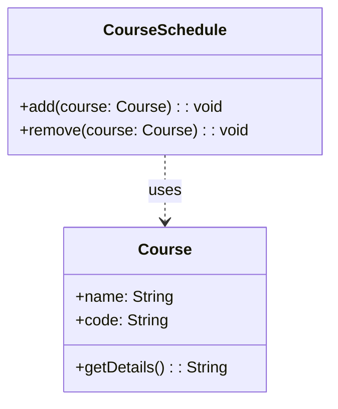
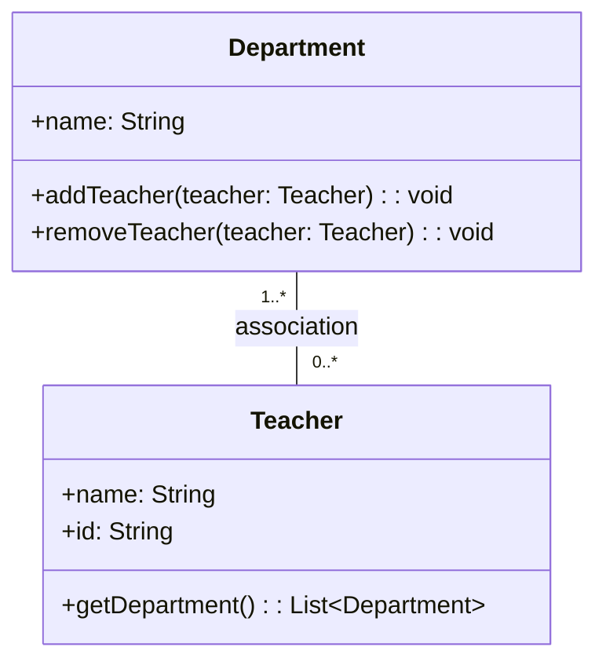

# 4-17

# 4-18

# 4-19
```
#include <iostream>

class CPU {
public:
    unsigned int clockSpeed : 12; // 时钟频率 (单位：MHz, 最大值3000MHz)
    unsigned int wordLength : 1;  // 字长 (0 表示 32 位, 1 表示 64 位)
    unsigned int coreCount : 2;   // 核数 (0: 单核, 1: 双核, 2: 四核)
    unsigned int hyperThreading : 1; // 是否支持超线程 (0: 不支持, 1: 支持)
};

int main() {
    CPU cpu;
    cpu.clockSpeed = 2500;      // 设置时钟频率为 2500MHz
    cpu.wordLength = 1;         // 设置为 64 位
    cpu.coreCount = 2;          // 设置为四核
    cpu.hyperThreading = 1;     // 设置为支持超线程

    std::cout << "Size of CPU class: " << sizeof(CPU) << " bytes" << std::endl;

    return 0;
}
```